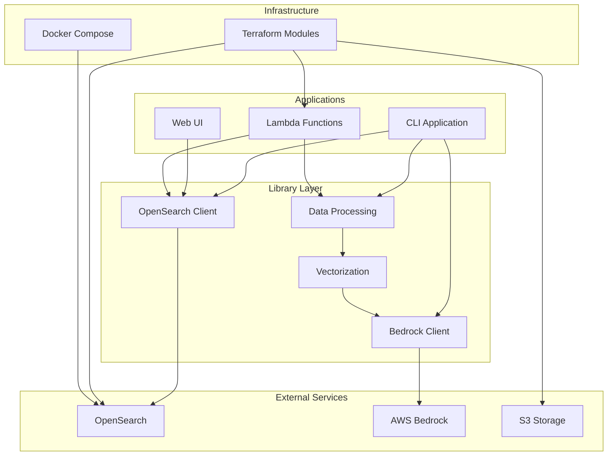

# Development Guide

Welcome to the development guide for the Entity Matching with Embeddings project.

## Overview

This section provides comprehensive information for developers who want to:

- Understand the project architecture
- Set up their development environment
- Run tests and validate changes
- Deploy infrastructure
- Extend and customize the system

## Architecture

The project follows a modular architecture with clear separation of concerns:



## Project Structure

```
entity-matching-with-embeddings/
├── apps/                      # Application entry points
│   ├── cli/                   # Command-line interface
│   │   ├── commands/          # Individual CLI commands
│   │   ├── main.py            # CLI entry point
│   │   └── utils.py           # CLI utilities
│   ├── lambda/                # AWS Lambda functions
│   │   └── ingest/            # S3-to-OpenSearch ingestion
│   └── web/                   # Streamlit web application
│       └── main.py            # Web app entry point
│
├── lib/                       # Core library code
│   ├── opensearch/            # OpenSearch client and utilities
│   │   └── client.py          # Main OpenSearch client
│   ├── file_token_estimation/ # Token counting utilities
│   ├── batch_processor.py     # Batch processing helpers
│   ├── bedrock.py             # AWS Bedrock client
│   ├── counter.py             # Async counter utility
│   ├── data_reader.py         # CSV/Excel file reading
│   ├── ingest.py              # Data ingestion logic
│   ├── logging.py             # Logging configuration
│   ├── rerank.py              # Result reranking
│   ├── utils.py               # General utilities
│   └── vectorize.py           # Embedding generation
│
├── deployment/                # Infrastructure as Code
│   ├── main.tf                # Main Terraform config
│   ├── variables.tf           # Input variables
│   ├── outputs.tf             # Output values
│   └── modules/               # Terraform modules
│       ├── lambda-ingest/     # Lambda function module
│       └── opensearch/        # OpenSearch domain module
│
├── tests/                     # Test suites
│   ├── conftest.py            # Root pytest config
│   ├── apps/                  # Application tests
│   └── lib/                   # Library tests
│       ├── opensearch/
│       │   ├── unit/          # Unit tests
│       │   └── integration/   # Integration tests
│       └── batch_processor/
│
├── docs/                      # Documentation (MkDocs)
├── docker-compose.yaml        # Local OpenSearch setup
├── terraform                  # Terraform wrapper script
├── terraform.Dockerfile       # Terraform Docker image
├── pyproject.toml             # Python project config
└── uv.lock                    # Locked dependencies
```

## Core Concepts

### Async/Await Pattern

The project uses async/await throughout for efficient I/O operations:

```python
from lib.bedrock import BedrockClient

async def process_embeddings():
    # Use as async context manager for automatic cleanup
    async with BedrockClient(concurrency=20) as bedrock:
        tasks = [
            bedrock.invoke(user_prompt=text, model_id=model_id)
            for text in texts
        ]
        
        results = await asyncio.gather(*tasks)
        return results

# Or with manual cleanup:
async def process_embeddings_manual():
    bedrock = BedrockClient(concurrency=20)
    try:
        tasks = [
            bedrock.invoke(user_prompt=text, model_id=model_id)
            for text in texts
        ]
        results = await asyncio.gather(*tasks)
        return results
    finally:
        await bedrock.close()  # Important: clean up connections
```

### Dependency Injection

Functions accept dependencies as parameters for testability:

```python
def main(*, opensearch: OpenSearchClient, file_path: str):
    """All dependencies passed as parameters."""
    data = read_data_file(file_path)
    opensearch.bulk_index(data)
```

### Batch Processing

Large datasets are processed in batches with resumability:

```python
from lib.batch_processor import process_batches

async def process_batch(*, batch_data: list, start_row: int, end_row: int):
    # Process this batch
    return results

results = await process_batches(
    data=data,
    batch_size=50,
    process_func=process_batch,
    skip_rows=0,  # For resuming
    limit_rows=None  # For testing
)
```

### Error Handling

Comprehensive error handling with user-friendly messages:

```python
from opensearchpy.exceptions import NotFoundError, ConflictError

try:
    opensearch.delete_index(index_name)
except NotFoundError:
    print(f"Index {index_name} not found")
except ConflictError as e:
    print(f"Cannot delete: {e}")
    # Parse error and handle dependencies
```

## Design Principles

### 1. Separation of Concerns

- **Applications** (apps/) - User interfaces and entry points
- **Libraries** (lib/) - Reusable business logic
- **Infrastructure** (deployment/) - Infrastructure as Code
- **Tests** (tests/) - Validation and quality assurance

### 2. Testability

- Pure functions where possible
- Dependency injection
- Comprehensive test coverage (unit + integration)
- Mock-friendly interfaces

### 3. Observability

- Structured logging
- Progress reporting for long operations
- Token usage tracking
- Error context and details

### 4. Resilience

- Retry logic for transient failures
- Batch processing with resumability
- Graceful degradation
- Clear error messages

### 5. Performance

- Async I/O for concurrent operations
- Batch processing for efficiency
- Concurrency control to avoid rate limiting
- Efficient data structures

## Development Workflow

### 1. Make Changes

Edit code in `lib/` or `apps/`:

```bash
# Edit a library module
vim lib/opensearch/client.py

# Edit a CLI command
vim apps/cli/commands/search.py
```

### 2. Run Tests

```bash
# Run unit tests
uv run pytest -m unit

# Run integration tests (localhost)
uv run pytest -m integration -m localhost

# Run specific test file
uv run pytest tests/lib/opensearch/unit/test_client_initialization.py
```

### 3. Test Locally

```bash
# Start local OpenSearch
docker compose up -d

# Test your changes
uv run python -m apps.cli.main setup --opensearch-host localhost --opensearch-port 9200 ...
```

### 4. Update Documentation

```bash
# Edit relevant docs
vim docs/cli-reference.md

# Preview documentation
uv run mkdocs serve
```

### 5. Deploy

```bash
# Deploy infrastructure changes
./terraform apply

# Deploy Lambda changes
./terraform apply -target=module.lambda_ingest
```

## Key Technologies

| Technology | Purpose | Documentation |
|------------|---------|---------------|
| Python 3.12+ | Primary language | [Python Docs](https://docs.python.org/3.12/) |
| uv | Package manager | [uv Docs](https://docs.astral.sh/uv/) |
| OpenSearch | Vector database | [OpenSearch Docs](https://opensearch.org/docs/) |
| AWS Bedrock | ML embeddings | [Bedrock Docs](https://docs.aws.amazon.com/bedrock/) |
| Terraform | Infrastructure | [Terraform Docs](https://www.terraform.io/docs) |
| pytest | Testing | [pytest Docs](https://docs.pytest.org/) |
| Streamlit | Web UI | [Streamlit Docs](https://docs.streamlit.io/) |

## Next Steps

- [Tooling](tooling.md) - Development tools and setup
- [Environment](environment.md) - Environment configuration
- [Testing](testing.md) - Running and writing tests
- [Deployment](deployment.md) - Infrastructure deployment

## Contributing

When contributing:

1. Follow existing code patterns
2. Add tests for new functionality
3. Update documentation
4. Run linters and formatters:
   ```bash
   uv run ruff check --fix lib/ apps/ tests/
   uv run ruff format lib/ apps/ tests/
   uv run pyright lib/ apps/
   ```
5. Test locally before deploying

See [Tooling](tooling.md) for detailed linting setup and configuration.

