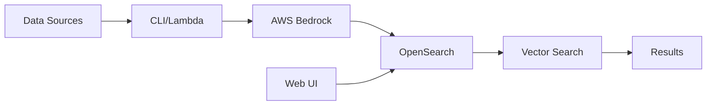

# Entity Matching with Embeddings

A Python-based solution for vector-based entity matching using AWS Bedrock embeddings and OpenSearch vector search capabilities.

## Overview

This project provides a complete toolkit for building entity matching systems using semantic search powered by machine learning embeddings. It combines AWS Bedrock's embedding models with OpenSearch's vector search to enable accurate and scalable entity matching.

## Key Features

- **Vector Search**: HNSW-based similarity search in OpenSearch for fast, accurate entity matching
- **AWS Bedrock Integration**: Use Amazon Titan and Cohere models for embeddings
- **Flexible CLI Tools**: Command-line interface for setup, ingestion, search, and evaluation
- **Batch Processing**: Efficient processing of large datasets with resumable operations
- **Web Interface**: Streamlit-based UI for interactive search and exploration
- **Infrastructure as Code**: Complete Terraform deployment for AWS infrastructure
- **Lambda Integration**: Automated S3-to-OpenSearch ingestion via Lambda functions
- **Comprehensive Testing**: Unit and integration test suites for both local and AWS environments

## Technology Stack

| Component | Technology |
|-----------|-----------|
| **Language** | Python 3.12+ |
| **Package Manager** | uv |
| **Vector Database** | OpenSearch 3.1+ |
| **Embeddings** | AWS Bedrock (Titan, Cohere) |
| **Cloud Provider** | AWS |
| **Infrastructure** | Terraform |
| **Web Framework** | Streamlit |
| **Testing** | pytest |

## Architecture



## Core Components

### CLI Application
Command-line tools for all OpenSearch operations:

- `setup` - Configure OpenSearch indexes for vector search
- `ingest` - Load data from CSV/Excel files
- `search` - Perform vector-based searches
- `evaluate` - Test search performance
- `dev` - Interactive API console
- `tokens` - Estimate token counts
- `vectorize` - Generate embeddings offline

### AWS Infrastructure
Complete deployment stack including:

- OpenSearch domain with vector search
- Lambda functions for automated ingestion
- S3 buckets for data storage
- IAM roles and policies
- Proper security configuration

### Web Interface
Streamlit-based application providing:

- Interactive search interface
- Semantic and keyword search modes
- OpenSearch API console
- Real-time result visualization

### Library Components
Reusable Python libraries:

- **OpenSearch Client**: Full-featured client for vector search operations
- **Bedrock Integration**: Async client for embeddings and chat
- **Data Processing**: CSV/Excel reading and batch processing
- **Vectorization**: Embedding generation utilities
- **Token Estimation**: File token counting

## Use Cases

- **Medical Entity Matching**: Match medical terms, codes, and descriptions (e.g., LOINC codes)
- **Product Catalog Search**: Find similar products across large catalogs
- **Document Deduplication**: Identify duplicate or near-duplicate documents
- **Customer Record Matching**: Link customer records across systems
- **Knowledge Base Search**: Semantic search across documentation

## Project Structure

```
├── apps/
│   ├── cli/              # Command-line interface
│   ├── lambda/           # AWS Lambda functions
│   └── web/              # Streamlit web application
├── lib/                  # Core library code
│   ├── opensearch/       # OpenSearch client
│   ├── file_token_estimation/  # Token counting
│   └── *.py              # Utilities (bedrock, vectorize, etc.)
├── deployment/           # Terraform infrastructure
├── tests/                # Test suites
└── docs/                 # Documentation (you are here!)
```

## Quick Links

- [Getting Started](getting-started.md) - Set up local development environment
- [Deploy on AWS](deploy-aws.md) - Deploy infrastructure to AWS
- [CLI Reference](cli-reference.md) - Complete command documentation
- [Web UI](web-ui.md) - Web interface guide
- [Development](development/index.md) - Developer documentation

## License

This project is provided as-is for educational and commercial use.

